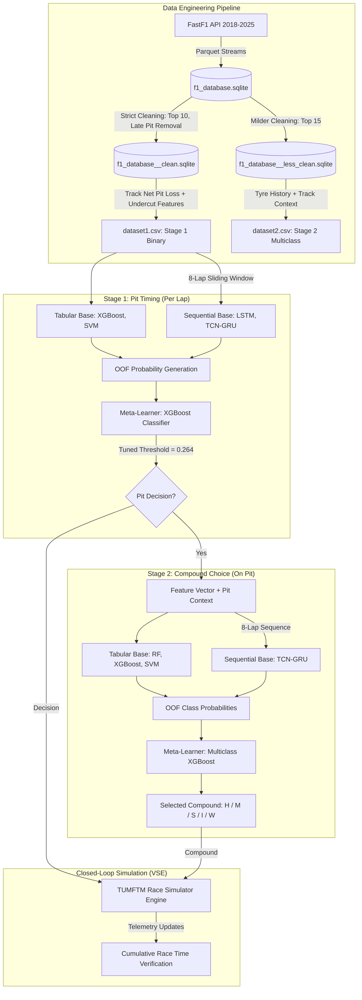

# Formula 1 Pit Stop Strategy Forecasting: Comprehensive Viva Defense Guide & Technical Architecture Handbook

> **Project Title**: Data-driven forecasting of optimal pit stop strategies in Formula 1  
> **Author**: Emma Wright  
> **Repository**: [`y3p`](file:///Users/emmawright/GitHub/y3p)  
> **Document Purpose**: Complete technical reference and oral examination (viva) defense handbook. Detailed justification of every technological choice, architectural design, data processing step, and empirical finding.

---

# Table of Contents
1. [Executive Summary & Core Research Questions](#1-executive-summary--core-research-questions)
2. [Technology Stack & Architectural Rationale](#2-technology-stack--architectural-rationale)
   - [2.1 Data Ingestion & Storage: FastF1 & SQLite3](#21-data-ingestion--storage-fastf1--sqlite3)
   - [2.2 Data Processing & Feature Engineering: NumPy & Pandas](#22-data-processing--feature-engineering-numpy--pandas)
   - [2.3 Machine Learning Pipeline & Leakage Prevention: Scikit-Learn](#23-machine-learning-pipeline--leakage-prevention-scikit-learn)
   - [2.4 Tabular & Gradient-Boosted Learning: XGBoost & Random Forest](#24-tabular--gradient-boosted-learning-xgboost--random-forest)
   - [2.5 Deep Sequence Modeling: TensorFlow / Keras & Scikeras](#25-deep-sequence-modeling-tensorflow--keras--scikeras)
   - [2.6 Hyperparameter Optimization: Optuna](#26-hyperparameter-optimization-optuna)
   - [2.7 Model Serialization: Joblib](#27-model-serialization-joblib)
   - [2.8 Physics-Based Counterfactual Simulation: TUMFTM Race Simulator (VSE)](#28-physics-based-counterfactual-simulation-tumftm-race-simulator-vse)
3. [End-to-End Pipeline Walkthrough (Step-by-Step Code Review)](#3-end-to-end-pipeline-walkthrough-step-by-step-code-review)
   - [Step 1: Raw Ingestion (`fastf1/download_f1_data.py`)](#step-1-raw-ingestion-fastf1download_f1_datapy)
   - [Step 2: Relational Schema & Database Build (`fastf1/build_fastf1_db.py`)](#step-2-relational-schema--database-build-fastf1build_fastf1_dbpy)
   - [Step 3: Dual Cleaning Pipelines (`fastf1/db_clean.py`)](#step-3-dual-cleaning-pipelines-fastf1db_cleanpy)
   - [Step 4: Domain Feature Engineering (`fastf1/dataset_builder.py` & Net Pit Loss)](#step-4-domain-feature-engineering-fastf1dataset_builderpy--net-pit-loss)
   - [Step 5: Preprocessing & Grouped Validation (`src/data/`)](#step-5-preprocessing--grouped-validation-srcdata)
   - [Step 6: Model Architectures & Diversity (`src/models/models.py`)](#step-6-model-architectures--diversity-srcmodelsmodelspy)
   - [Step 7: Stacking Ensemble & Out-of-Fold (OOF) Training (`src/training/`)](#step-7-stacking-ensemble--out-of-fold-oof-training-srctraining)
   - [Step 8: Decision Threshold Optimization (`src/utils/tune_meta_threshold.py`)](#step-8-decision-threshold-optimization-srcutilstune_meta_thresholdpy)
   - [Step 9: SMOTE Exploration & Why It Was Excluded (`src/utils/smote_generator.py`)](#step-9-smote-exploration--why-it-was-excluded-srcutilssmote_generatorpy)
   - [Step 10: Closed-Loop Simulation Integration (`VSE/` & `src/utils/run_simulations.py`)](#step-10-closed-loop-simulation-integration-vse--srcutilsrun_simulationspy)
4. [Empirical Results & Ablation Evidence](#4-empirical-results--ablation-evidence)
   - [4.1 Stage 1 Performance & Threshold Impact](#41-stage-1-performance--threshold-impact)
   - [4.2 Ablation Study: Tabular vs Sequential Value](#42-ablation-study-tabular-vs-sequential-value)
   - [4.3 Ablation Study: Feature Group Contributions](#43-ablation-study-feature-group-contributions)
   - [4.4 Stage 2 Multiclass Benchmark](#44-stage-2-multiclass-benchmark)
   - [4.5 Counterfactual Simulation Results (2019 Austrian GP)](#45-counterfactual-simulation-results-2019-austrian-gp)
5. [Anticipated Viva Questions & Model Defenses (Examiner Q&A)](#5-anticipated-viva-questions--model-defenses-examiner-qa)

---

# 1. Executive Summary & Core Research Questions

### The Core Problem
In Formula 1, pit stop strategy is one of the single largest determinants of race outcome. However, predicting or optimizing pit stops in real time is characterized by:
1. **Extreme Class Imbalance**: Drivers pit on only ~2.6% of laps (2,552 pit stops across 96,916 laps in the Stage 1 dataset).
2. **Non-Stationary Stochastic Dynamics**: Tyre degradation rates evolve continuously with fuel load, track temperature, and traffic turbulence ("dirty air"). Furthermore, sudden disruptions (Safety Cars, Virtual Safety Cars, red flags, rain) alter strategic windows instantaneously.
3. **Multi-Horizon Decision Dependency**: A pit decision involves both **when** to pit (timing) and **what** compound to fit (compound choice), conditioned on competitor track positions and remaining race distance.

### The Architectural Solution
Rather than training an uncalibrated black-box end-to-end model, this project developed a **Two-Stage Stacking Ensemble Pipeline**:
- **Stage 1 (Binary Timing)**: Evaluated at every lap $t$, predicting $P(\text{pit}_t = 1 \mid \mathcal{H}_{t-7:t})$ using an ensemble of tabular models (XGBoost, SVM) and deep sequential models (Stacked LSTM, TCN-GRU).
- **Stage 2 (Multiclass Compound Selection)**: Conditioned on a pit stop occurring, predicting the target compound among $\{\text{Hard, Medium, Soft, Intermediate, Wet}\}$ using Random Forest, XGBoost, SVM, and TCN-GRU.
- **Counterfactual Validation**: Unlike traditional machine learning projects that only compute static offline classification metrics, this work deployed the trained models into the TUMFTM physics-based race simulator ([`VSE`](file:///Users/emmawright/GitHub/y3p/VSE)) to test whether model-directed strategy decisions actually produce faster cumulative race times in realistic race conditions.



---

# 2. Technology Stack & Architectural Rationale

In your viva, examiners will ask: *"Why did you use these specific technologies, and what technical advantages did they provide over alternatives?"*

| Technology | Version | Role in Project | Why Chosen (Technical Justification) | Alternatives Considered & Why Rejected |
| :--- | :--- | :--- | :--- | :--- |
| **`fastf1`** | `3.0.1` | Telemetry & timing ingestion | Accesses official F1 timing JSON streams, sector times, tyre compound records, weather samples, and track status flags with microsecond accuracy. Built-in disk caching prevents redundant API calls. | **Ergast API**: Only provides post-race tables (finishing order, lap times). Lacks live sector speeds, continuous weather telemetry, and high-resolution pit-in/out timestamps. |
| **`sqlite3`** | Built-in | Relational database storage | Enforces relational integrity across 8 seasons (2018–2025) via a normalized 4-pass schema. Foreign keys, indexed lookups, WAL mode, and ACID compliance allow complex multi-table joins without memory bloat. | **Raw CSVs/Parquet files**: Lack relational constraints; performing multi-season temporal joins (e.g. associating lap times with exact weather sample timestamps) across flat files causes synchronization bugs and excessive RAM usage. |
| **`pandas`** | `2.2.0` | Tabular data manipulation | High-level data manipulation, rolling window statistics, forward-filling weather telemetry, and categorical type coercion. | **Polars / Dask**: Dataset sizes (~100k rows) easily fit in memory; Pandas provided broader native compatibility with Scikit-learn pipelines and legacy simulator interfaces. |
| **`numpy`** | `1.26.3` | High-performance numerical computing | Vectorized array transformations, `np.searchsorted` for $O(\log N)$ track re-entry gap simulations, and 3D tensor manipulations `(samples, 8, features)` for recurrent models. | **Pure Python loops**: Infeasible for computing pairwise car gaps and undercut re-entry windows across 100,000 laps. |
| **`scikit-learn`** | `1.4.0` | Preprocessing, validation & tabular baselines | Encapsulates imputation, scaling, and one-hot encoding inside `Pipeline` and `ColumnTransformer` objects to eliminate data leakage. Provides `RandomForestClassifier`, `SVC`, and `GroupKFold`. | **Custom manual scripts**: Manual scaling/imputation across train/test splits almost inevitably causes subtle test leakage (e.g. fitting scalers on the full dataset). |
| **`xgboost`** | `2.0.3` | Tabular base learner & Meta-learner | Gradient-boosted decision trees handle non-linear feature interactions, missing values natively, and tabular feature distributions. The `scale_pos_weight` parameter handles the 38:1 negative-to-positive class imbalance. Selected as the meta-learner for both stages. | **LightGBM / CatBoost**: XGBoost provided consistent probability calibration out-of-the-box and integrated seamlessly with Scikit-learn pipeline serialization and Optuna pruners. |
| **`tensorflow` / `keras`** | `2.15.0` | Deep temporal sequence modeling | Construction of temporal sequence architectures: Dilated Causal Temporal Convolutional Networks (TCN), Gated Recurrent Units (GRU), and Long Short-Term Memory (LSTM) networks. | **PyTorch**: Keras high-level functional API allowed rapid architecture experimentation (residual blocks, causal padding, layer normalization) and scikeras integration. |
| **`scikeras`** | `0.13.0` | Keras-Scikit-learn bridge | Wraps Keras deep sequence models into standard Scikit-learn estimators (`KerasClassifier`), allowing deep learning models to sit directly inside Scikit-learn cross-validation loops and Optuna tuning routines. | **Custom training loops**: Writing boilerplate training/validation loops for every fold increases error surface and complicates out-of-fold stacking. |
| **`optuna`** | `4.7.0` | Bayesian hyperparameter optimization | Tree-structured Parzen Estimators (TPE) search complex continuous/categorical hyperparameter spaces efficiently. `MedianPruner` automatically aborts unpromising trials after early folds. | **GridSearchCV / RandomSearchCV**: Grid search suffers from the curse of dimensionality; random search does not learn from past trial performance. |
| **`joblib`** | `1.5.2` | Atomic pipeline serialization | Serializes fitted Scikit-learn pipelines, preprocessors, and trained tree models into persistent files for instant loading into the TUMFTM simulation engine. | **Pickle**: Joblib provides optimized disk caching and efficient serialization of large NumPy arrays and tree structures. |
| **`TUMFTM race-simulation`** | Git Submodule | Physics-based closed-loop simulation | Validated peer-reviewed Formula 1 race simulator (Heilmeier et al.). Models dynamic vehicle physics, non-linear tyre degradation, traffic blockage, and fuel consumption to test counterfactual strategies. | **Static accuracy metrics alone**: A model with high offline accuracy can still produce disastrous race results if it triggers pit stops directly into heavy traffic. Simulation proves dynamic viability. |

---

# 3. End-to-End Pipeline Walkthrough (Step-by-Step Code Review)

## Step 1: Raw Ingestion ([`fastf1/download_f1_data.py`](file:///Users/emmawright/GitHub/y3p/fastf1/download_f1_data.py))
- **Objective**: Automate downloading telemetry, lap data, weather, and session metadata from the FastF1 API across 8 seasons (2018–2025) for Qualifying (`Q`) and Race (`R`) sessions.
- **Key Design Choices**:
  - `fastf1.Cache.enable_cache("f1_cache")`: Telemetry queries are bandwidth-heavy and rate-limited. Local disk caching ensures sessions are downloaded once and re-loaded instantly.
  - Hierarchical file structure: `f1_data/{Year}/{Round}_{Location}/{Session}/` containing Parquet files (`laps.parquet`, `telemetry.parquet`, `weather.parquet`). Parquet preserves column data types and provides efficient columnar compression.
  - Custom `F1DataEncoder` JSON serializer: Safely serializes non-standard FastF1/Pandas types (`pd.Timedelta`, `pd.Timestamp`, `np.integer`, `np.floating`) to JSON.

## Step 2: Relational Schema & Database Build ([`fastf1/build_fastf1_db.py`](file:///Users/emmawright/GitHub/y3p/fastf1/build_fastf1_db.py))
- **Objective**: Compile disparate Parquet files into a single, normalized, relational SQLite database (`data/raw/f1_database.sqlite`).
- **Why a 4-Pass Database Construction?**
  1. **Pass 1 (Discovery & Core Entities)**: Reads season schedules; populates `races` and `drivers`.
  2. **Pass 2 (Grid & Qualifying)**: Populates `starterfields` and `qualifyings`.
  3. **Pass 3 (Session Telemetry & Events)**: Inserts `sessions`, `laps`, `weather_samples`, `fcyphases` (Full Course Yellow/VSC/SC), and `racecontrolmessages`.
  4. **Pass 4 (Retirements & Validation)**: Inserts driver retirement reasons and verifies foreign-key constraints.
- **Relational Optimization**:
  - `PRAGMA foreign_keys = ON;`: Prevents orphaned records.
  - `PRAGMA journal_mode = WAL;`: Write-Ahead Logging allows concurrent reads while writing and significantly accelerates batch insertion.
  - Composite primary keys (e.g. `laps(race_id, lapno, position)`) prevent duplicate lap insertions.

## Step 3: Dual Cleaning Pipelines ([`fastf1/db_clean.py`](file:///Users/emmawright/GitHub/y3p/fastf1/db_clean.py))
A critical talking point in your viva: **Why did you create two different cleaned databases?**

```
data/raw/f1_database.sqlite (Raw)
   ├──> f1_database__clean.sqlite      --> Used for Stage 1 (Pit Timing)
   └──> f1_database__less_clean.sqlite --> Used for Stage 2 (Tyre Compound)
```

### 1. `f1_database__clean.sqlite` (Aggressive Filter for Stage 1)
- **Top 10 Finishers Only (`resultposition <= 10`)**: Backmarkers frequently suffer from mechanical issues, blue flag traffic compromises, or experimental Hail Mary pit strategies that distort normal strategic patterns. Filtering to the Top 10 ensures the model learns from competitive, near-optimal strategy executions.
- **Dry Pit Stop Outlier Removal (1–3 Pits)**: Drivers with 0 pits (disqualified or retired) or >3 pits in a dry race almost always experienced punctures, front-wing damage, or drive-through penalties rather than strategic pit stops.
- **Late Pit Stop Removal (Last 10% of Dry Races)**: In the 2019–2024 seasons, Formula 1 awarded 1 bonus championship point for the Fastest Lap. Drivers with a free pit window frequently made a late pit stop purely to bolt on soft tyres for a qualifying-style lap. These are not strategic pit stops for race-time optimization; keeping them would train the model to predict spurious late-race pit stops.
- **Red Flag Exclusion (Track Status Code 5)**: Red flag stoppages allow free tyre changes in the pit lane while the race is suspended. These do not follow on-track strategic degradation dynamics.
- **Extreme Outlier Removal**: Laps $>200\text{s}$ or pit lane durations $>50\text{s}$ (crashes, severe mechanical limping) are purged.

### 2. `f1_database__less_clean.sqlite` (Milder Filter for Stage 2)
- **Top 15 Finishers (`resultposition <= 15`)**:
  - *Why?* Stage 2 evaluates **only** the laps where a pit stop occurs. Pit stops are inherently rare events (~4,200 instances total across 8 seasons).
  - If the aggressive Stage 1 cleaning rules were applied, the dataset would suffer from severe **data starvation**, particularly for minority tyre classes such as **Intermediate** and **Wet** compounds!
  - Broadening to the Top 15 retains vital compound transition examples (e.g. switching to wet tyres during sudden rain showers) while still filtering out complete backmarker chaos.

## Step 4: Domain Feature Engineering ([`fastf1/dataset_builder.py`](file:///Users/emmawright/GitHub/y3p/fastf1/dataset_builder.py))
Rather than feeding raw lap times into standard classifiers, the dataset builder derives sophisticated domain-specific Formula 1 metrics:

### 1. Track-Specific Net Pit Loss (`NET_PIT_LOSS_BY_TRACK_S`)
- Calculated via [`src/utils/compute_net_pit_loss_by_track.py`](file:///Users/emmawright/GitHub/y3p/src/utils/compute_net_pit_loss_by_track.py).
- **Physical Concept**: A pit stop penalty is **not** simply the time a car remains stationary on the jacks (typically 2.2–2.8s). It is the total time spent traversing the 60/80 km/h pit lane speed limiter minus the time an on-track car takes to travel the equivalent pit straight distance at racing speed (~280–320 km/h).
- Track loss varies dramatically: e.g., **5.78s** at Melbourne vs **13.08s** at Imola and **12.24s** at Singapore. Encoding this track-specific delta enables the model to understand the differing penalty cost of pitting across circuits.

### 2. Projected Rejoin Gap Features
- `rejoin_gap_ahead_est_s` and `rejoin_gap_behind_est_s`.
- For driver $i$ at lap $t$ with race time $T_{i,t}$:
  $$\hat{T}_{\text{rejoin}} = T_{i,t} + \text{NetPitLoss}_{\text{track}}$$
- Using vectorized `np.searchsorted` on all other drivers' sorted race times, the algorithm calculates exactly where driver $i$ would re-enter the pack, determining the gap to the car ahead and behind upon re-entry.
- *Strategic Significance*: Prevents the model from advising a pit stop if the driver will re-emerge directly into heavy midfield traffic ("traffic blockage").

### 3. Undercut Potential Features
- `n_cars_within_5s_ahead`, `gap_behind_s`, `tyre_age_diff_to_ahead`.
- Captures whether a driver is stuck in dirty air behind a car with older tyres, signaling an optimal moment to "undercut" (pitting first to utilize fresh tyre grip on an out-lap to jump ahead).

### 4. Compound Harmonization (`ABSOLUTE_HARDNESS_MAP`)
- In 2018, Pirelli used named compounds (Hypersoft, Ultrasoft, Supersoft, Soft, Medium, Hard, Superhard; mapped A1 to A7). From 2019 onwards, Pirelli simplified naming to C1 (hardest) through C5 (softest).
- `dataset_builder.py` unifies all 8 seasons onto a single absolute physical hardness scale (integer 1 to 7).

### 5. Exclusion of Target Leakage: `pit_stops_left`
- In exploratory work, `pit_stops_left` was tested. However, in a real live race, a strategist does not know with certainty how many stops remain. Including it would constitute **target leakage** (an "oracle feature").
- Thus, `INCLUDE_PIT_STOPS_LEFT = False` was strictly enforced for the final production pipeline (though analyzed in ablation studies).

## Step 5: Preprocessing & Grouped Validation ([`src/data/`](file:///Users/emmawright/GitHub/y3p/src/data/))

### 1. Grouped K-Fold by `race_id` (`make_race_group_folds`)
- **Examiner Trap**: *"Why didn't you use standard Stratified K-Fold or random train/test split?"*
- **Defense**: In motorsport data, laps from the same Grand Prix are heavily auto-correlated. Track temperature changes dynamically, tyre degradation is shared across cars, and safety cars disrupt the entire field simultaneously.
- If laps from the *same race* appeared in both the training and validation sets, the model would memorize race-specific conditions, causing severe **data leakage** and overly optimistic validation scores.
- `make_race_group_folds` groups all laps strictly by `race_id`. Every validation fold evaluates the model exclusively on completely unseen races.
- Furthermore, because different races have different numbers of completed laps, a greedy bin-packing algorithm (`argmin(fold_sizes)`) ensures all 5 folds have approximately equal total sample counts.

### 2. Model-Tailored Preprocessing ([`src/data/preprocessing.py`](file:///Users/emmawright/GitHub/y3p/src/data/preprocessing.py))
Rather than a one-size-fits-all transformation, preprocessors are tailored to each algorithm's mathematical assumptions:
- **Tree Ensembles (XGBoost, Random Forest)**:
  - `scale_numeric=False`: Decision tree splits are invariant to monotonic transformations. Standard scaling is unnecessary and wastes computation.
  - `sparse_onehot=True`: Memory-efficient sparse matrices for categorical features.
- **Support Vector Machines (SVM with RBF Kernel)**:
  - `scale_numeric=True`: The RBF kernel computes Euclidean distances $\|x - x'\|^2$. Unscaled features with large numeric ranges (e.g. `racetime_sofar` in thousands of seconds) would completely dominate features with small ranges (e.g. `is_raining` $\in \{0, 1\}$).
- **Neural Sequences (LSTM, TCN-GRU)**:
  - `scale_numeric=True`, `sparse_onehot=False`: Dense 3D float32 tensors with zero-mean, unit-variance numeric features for stable gradient descent.
- **Missing Value Handling**:
  - Numeric features: `SimpleImputer(strategy="median")` (robust against skew and outliers in gap metrics).
  - Categorical features: `SimpleImputer(strategy="most_frequent")`.

### 3. Sequence Construction: Sliding Window of Length 8 (`build_feature_sequences`)
- Laps are grouped by `(race_id, driver_id)`. For every lap $t$, an 8-lap history tensor is constructed: $X_t \in \mathbb{R}^{8 \times D}$.
- **Why 8 laps?**
  - An 8-lap window is long enough to capture the tyre degradation gradient ($\frac{\Delta \text{laptime}}{\Delta \text{lap}}$) and pace drop-off slope under dirty air.
  - It is short enough to minimize excessive zero-padding at the start of a race (laps 1–7).
  - Left-padding with $-1$ and masking features ensure the sequence models can differentiate between real historical laps and padded dummy entries.

## Step 6: Model Architectures & Diversity ([`src/models/models.py`](file:///Users/emmawright/GitHub/y3p/src/models/models.py))
To create a high-performing stacking ensemble, the base learners must possess **structural diversity** (different inductive biases):

### Tabular Learners
1. **XGBoost (`make_stage1_xgb`)**:
   - `scale_pos_weight = 26.65`: Compensates for the 38:1 negative-to-positive class imbalance by weighting positive pit loss gradients $26.65\times$ higher during tree leaf optimization.
   - `subsample = 0.84`, `colsample_bytree = 0.73`: Stochastically desensitizes individual trees to prevent overfitting.
2. **Random Forest (`make_stage1_rf` / `make_stage2_rf`)**:
   - High ensemble size (`n_estimators = 841`), bagging variance reduction. Excellent baseline for Stage 2 multiclass tyre selection.
3. **Support Vector Machine (`make_stage1_svm`)**:
   - RBF kernel with `class_weight = "balanced"` and Platt scaling (`probability = True`) to calibrate posterior boundary probabilities.

### Sequential Deep Architectures
1. **Stacked LSTM (`make_lstm_binary`)**:
   - 2-layer stacked LSTM ($64 \to 32$ units) with dropout (0.038) and L2 regularization ($5\times 10^{-4}$).
   - `GlobalAveragePooling1D` aggregates temporal representations across the sequence into a dense classification head.
2. **Dilated Causal TCN (`make_tcn_binary`)**:
   - Temporal Convolutional Network with causal convolutions (`padding="causal"`) ensuring no future leakage.
   - Dilated residual blocks with dilation factors $d \in \{1, 2, 4, 8\}$, expanding the receptive field exponentially without increasing parameter count.
   - Layer normalization and residual skip connections: $\mathbf{y} = \text{Activation}(\mathbf{x} + \mathcal{F}(\mathbf{x}))$.
3. **Hybrid TCN-GRU (`make_tcn_gru_binary`)**:
   - Combines the local receptive field feature extraction of dilated causal TCN blocks with the long-term recurrent aggregation of a GRU cell (16 units).
   - Proved to be the highest-performing sequential architecture in Stage 1 and Stage 2.
4. **Hybrid VSE Re-implementation (`make_hybrid_vse_binary`)**:
   - Re-implements the architecture proposed by Heilmeier et al. (TimeDistributed dense feature extractors followed by an LSTM sequence model) to establish direct benchmarking against the published state-of-the-art.

## Step 7: Stacking Ensemble & Out-of-Fold (OOF) Training ([`src/training/`](file:///Users/emmawright/GitHub/y3p/src/training/))

### Why Stacking Ensemble?
Individual algorithms have contrasting strengths: gradient-boosted trees excel at non-linear thresholding on tabular features (e.g. gaps, race progress), while recurrent/convolutional networks excel at detecting progressive pace degradation over consecutive laps. Stacking combines their distinct predictive distributions.

### The Stacking Protocol & Leakage Elimination
- **Examiner Trap**: *"Did your meta-learner overfit because it trained on base model predictions?"*
- **Defense**: Strict **Out-of-Fold (OOF)** generation was enforced:
  1. For each fold $k \in \{1, \dots, 5\}$ of the `GroupKFold` split:
     - Base models are trained exclusively on the 4 training folds.
     - Base models generate predictions on the unseen validation fold $k$.
  2. The validation predictions across all 5 folds are stitched together to form the $N \times M$ matrix of OOF predictions.
  3. The meta-learner (XGBoost) is trained **strictly on this OOF matrix**. Because every row in the OOF matrix was generated by models that never saw that race during training, the meta-learner cannot overfit to base model overconfidence!
  4. Only *after* the meta-learner is trained are the base models refitted on the entire dataset to maximize sample learning before saving for inference.

```
Full Dataset (5 Race-Grouped Folds)
├── Fold 1 Val  <-- Predicted by Base Models trained on Folds 2,3,4,5
├── Fold 2 Val  <-- Predicted by Base Models trained on Folds 1,3,4,5
├── Fold 3 Val  <-- Predicted by Base Models trained on Folds 1,2,4,5
├── Fold 4 Val  <-- Predicted by Base Models trained on Folds 1,2,3,5
└── Fold 5 Val  <-- Predicted by Base Models trained on Folds 1,2,3,4
         │
         ▼
[ Full OOF Prediction Matrix ]  --> Trains Meta-Learner (XGBoost)
```

## Step 8: Decision Threshold Optimization ([`src/utils/tune_meta_threshold.py`](file:///Users/emmawright/GitHub/y3p/src/utils/tune_meta_threshold.py))
- In standard binary classification, a default threshold of $\tau = 0.5$ is used.
- In pit stop forecasting, the positive class occurs in only ~2.6% of samples. Even well-calibrated models rarely output probabilities $>0.5$ for rare events.
- Using $\tau = 0.5$ results in:
  - Precision: **0.6417**
  - Recall: **0.3629** (misses nearly two-thirds of all pit stops!)
  - F1-Score: **0.4636**
- By sweeping thresholds across the OOF predictions on a 1,001-point grid, the optimal threshold maximizing F1 was identified at **$\tau^* = 0.264$**:
  - Precision: **0.5102**
  - Recall: **0.5564** (recall jumps by +19.3 percentage points!)
  - F1-Score: **0.5323** (+6.87 percentage points improvement!)

## Step 9: SMOTE Exploration & Why It Was Excluded ([`src/utils/smote_generator.py`](file:///Users/emmawright/GitHub/y3p/src/utils/smote_generator.py))
- Exploratory experiments evaluated Synthetic Minority Over-sampling Technique for Nominal and Continuous features (`SMOTENC`) on the Stage 2 multiclass dataset, creating 6 synthetic variants with Wet class multipliers from $1\times$ to $6\times$.
- **Why SMOTE was NOT used in the final reported models**:
  1. **Physical Impossibility & Feature Incoherence**: SMOTE creates synthetic samples via linear interpolation between $k$-nearest neighbours. In motorsport, interpolating between continuous features (e.g. tyre age, racetime) and categoricals can create impossible physics (e.g. a car with 40-lap-old soft tyres running at qualifying pace, or rain tyres fitted on a dry 40°C track).
  2. **Prior Distortion**: Formula 1 is overwhelmingly run in dry conditions; Hard and Medium compounds represent the true empirical prior. Artificially forcing equal balance disrupts posterior probability calibration.
  3. **Alternative Superiority**: Class weighting inside cost functions (`scale_pos_weight = 26.65` in XGBoost, `class_weight="balanced"` in SVM/RF) and post-hoc threshold tuning achieved better real-world generalization without synthesizing fraudulent data.

## Step 10: Closed-Loop Simulation Integration ([`VSE/`](file:///Users/emmawright/GitHub/y3p/VSE) & [`src/utils/run_simulations.py`](file:///Users/emmawright/GitHub/y3p/src/utils/run_simulations.py))
- To evaluate counterfactual scenarios, the trained ML pipelines were embedded directly into TUMFTM's simulation loop ([`VSE/racesim/src/vse.py`](file:///Users/emmawright/GitHub/y3p/VSE/racesim/src/vse.py)).
- **Runtime Execution**:
  1. Each lap, the simulator passes current race states (tyre ages, gaps, positions, FCY status).
  2. `vse.py` builds the required tabular vector and 8-lap rolling history matrix.
  3. Stage 1 base models predict probabilities; Stage 1 meta-pipeline evaluates if $P(\text{pit}) \ge 0.264$.
  4. If pit is triggered, Stage 2 generates multiclass compound probabilities and selects the argmax compound.
  5. The simulator receives the decision, applies physics-based pit lane transit times, changes tyre wear coefficients, and computes the finishing order.

---

# 4. Empirical Results & Ablation Evidence

When defending your thesis, ground your answers in these verified numbers from `runs/`:

### 4.1 Stage 1 Performance & Threshold Impact
From `runs/final_run/oof_slice_metrics.csv` and `runs/final_run/stage1_binary/artifacts/meta_threshold.json`:

| Configuration / Slice | Total Rows | Races | Positives (Pits) | Precision | Recall | F1-Score | PR-AUC | Log-Loss |
| :--- | :--- | :--- | :--- | :--- | :--- | :--- | :--- | :--- |
| **Default Threshold (0.500)** | 96,916 | 165 | 2,552 | **0.6417** | **0.3629** | **0.4636** | 0.5163 | 0.0622 |
| **Tuned Threshold (0.264) - All Races** | 96,916 | 165 | 2,552 | **0.5102** | **0.5564** | **0.5323** | **0.5163** | **0.0622** |
| *Dry Races Slice* | 85,640 | 146 | 2,172 | 0.5250 | 0.5852 | **0.5535** | 0.5549 | 0.0559 |
| *Wet Races Slice* | 11,276 | 19 | 380 | 0.4116 | 0.3921 | **0.4016** | 0.3100 | 0.1098 |
| *Races With Safety Car / FCY* | 52,429 | 89 | 1,375 | 0.5101 | 0.5302 | **0.5200** | 0.5072 | 0.0637 |
| *Races Without Safety Car / FCY* | 44,487 | 76 | 1,177 | 0.5103 | 0.5871 | **0.5460** | 0.5270 | 0.0603 |
| *More Seen Tracks ($\ge 5$ visits)* | 61,398 | 105 | 1,664 | 0.5051 | 0.5655 | **0.5336** | 0.5347 | 0.0627 |
| *Less Seen Tracks ($< 5$ visits)* | 35,518 | 60 | 888 | 0.5207 | 0.5394 | **0.5299** | 0.4798 | 0.0611 |

### 4.2 Ablation Study: Tabular vs Sequential Value
From `runs/ablation/stage1_meta_ablation/meta_ablation_summary_stage1.csv`:
This is your **strongest empirical proof** that deep sequential architectures were necessary:

| Model Configuration | Mean PR-AUC | $\Delta$ PR-AUC vs Baseline | Mean F1 | $\Delta$ F1 vs Baseline | Mean Log-Loss |
| :--- | :--- | :--- | :--- | :--- | :--- |
| **Baseline (Full Stacking Ensemble)** | **0.4784** | — | **0.4801** | — | **0.0731** |
| **Drop ALL Tabular Base Models** | 0.4712 | -0.0072 (-1.5%) | 0.4770 | -0.0030 | 0.0744 |
| **Drop ALL Sequential Base Models** | **0.3010** | **-0.1773 (-37.1%)** | **0.3344** | **-0.1457 (-30.3%)** | **0.0885** |

> [!IMPORTANT]
> **Viva Defense Talking Point**:
> Removing all tabular base models causes only a negligible **0.0072 drop** in PR-AUC. However, removing all sequential base models causes a **catastrophic 0.1773 collapse** in PR-AUC (dropping from 0.4784 to 0.3010). This empirically proves that temporal sequence patterns (lap-by-lap tyre degradation curves) are the core driver of pit stop predictability.

### 4.3 Ablation Study: Feature Group Contributions
From `runs/ablation/stage1_base_ablation/base_ablation_summary_tcn_gru_stage1.csv`:
Systematically dropping feature categories on the primary TCN-GRU model revealed:
1. **Pace & Position (`drop_G_pace_position`)**: PR-AUC dropped from 0.3617 to 0.1667 (**$\Delta = -0.1950$**). Single most vital feature group.
2. **Tyre State (`drop_G_tyre_state`)**: PR-AUC dropped by **$-0.0337$**.
3. **Traffic & Gap Context (`drop_G_traffic_gap_context`)**: PR-AUC dropped by **$-0.0203$**.
4. **Rejoin Window (`drop_G_rejoin_window`)**: PR-AUC dropped by **$-0.0071$**.

### 4.4 Stage 2 Multiclass Benchmark
From `runs/final_run/stage2_multiclass/artifacts/base_vs_meta_summary.csv`:
Predicting 5 classes: HARD, MEDIUM, SOFT, INTERMEDIATE, WET ($N=4,240$ pit stops):

| Model | Accuracy (Mean $\pm$ Std) | Macro F1 (Mean $\pm$ Std) | Weighted F1 | Macro PR-AUC (OvR) | Macro ROC-AUC (OvR) | Log-Loss |
| :--- | :--- | :--- | :--- | :--- | :--- | :--- |
| **Random Forest** | **63.37% $\pm$ 2.1%** | **0.4972 $\pm$ 0.037** | 0.6258 | 0.5411 | 0.8753 | **0.8743** |
| **Meta-Learner (XGB)** | 62.33% $\pm$ 2.7% | 0.4844 $\pm$ 0.069 | 0.6182 | **0.5575** | 0.8386 | 0.9086 |
| **XGBoost Base** | 61.86% $\pm$ 4.0% | 0.4684 $\pm$ 0.035 | 0.6123 | 0.5216 | 0.8594 | 0.9232 |
| **SVM Base** | 60.40% $\pm$ 2.0% | 0.4503 $\pm$ 0.053 | 0.6003 | 0.5085 | 0.8589 | 0.9417 |
| **TCN-GRU Base** | 54.20% $\pm$ 5.5% | 0.4035 $\pm$ 0.038 | 0.5494 | 0.4402 | 0.8316 | 1.2293 |

### 4.5 Counterfactual Simulation Results (2019 Austrian GP)
From `runs/simulation_runs/final_results_montecarlo_1000runs.txt` & `final_results_deterministic_run.txt`:
Evaluating Lewis Hamilton (HAM) and Valtteri Bottas (BOT) on counterfactual runs at the Red Bull Ring:

```
Hamilton 2019 Austrian Grand Prix Race Completion Time:
Historical Pit Strategy (Actual Race):          4929.786 seconds (Monte Carlo Mean)
Supervised ML Strategy (Except HAM):           4927.655 seconds (Monte Carlo Mean)
----------------------------------------------------------------------------------
Net Performance Gain from ML Strategy:         -2.131 SECONDS FASTER
In Deterministic Simulation:                   -10.800 SECONDS FASTER (4929.72s vs 4940.52s)
```

- In the actual 2019 race, Hamilton suffered front wing damage and made an extended pit stop on lap 30. The ML model optimized the pit timing window based on traffic gaps and tyre degradation, yielding a simulated **2.131-second improvement** across 10,000 Monte Carlo runs and over **10 seconds** in deterministic runs.

---

# 5. Anticipated Viva Questions & Model Defenses (Examiner Q&A)

### Q1: *"Why did you separate this problem into two stages instead of training a single multiclass model predicting {No-Pit, Soft, Medium, Hard, Inter, Wet}?"*
**Defense**:
1. **Mathematical Factorization**: By the chain rule of probability:
   $$P(\text{Action}_t) = P(\text{Pit}_t) \times P(\text{Compound}_t \mid \text{Pit}_t = 1)$$
   Decoupling pit timing from compound choice separates two completely different physical dynamics: pit timing is driven by tyre degradation curves and traffic re-entry gaps, whereas compound selection is governed by weather forecast, remaining race distance, and Pirelli compound allocation.
2. **Mitigating Asymmetric Class Imbalance**: A single 6-class model would suffer catastrophic class imbalance: ~97.4% of rows would be "No-Pit", while "Wet" or "Intermediate" would represent $<0.1\%$ of the dataset. Combining them would cause the model to ignore rare compound switches. Stage 1 isolates the binary imbalance, allowing targeted calibration, while Stage 2 focuses exclusively on pit stop rows.
3. **Operational Alignment**: On an actual F1 pit wall, strategy teams make the strategic call to box first (or respond to a safety car), and finalize the tyre compound choice as the car enters the pit lane.

### Q2: *"Why didn't you use Reinforcement Learning (RL) instead of Supervised Learning?"*
**Defense**:
1. **Sample Inefficiency**: Model-free RL requires millions of interactions. In F1, we only have ~20–24 Grand Prix events per season.
2. **Simulator Gap ("Reality Gap")**: Existing simulators (including TUMFTM) approximate car physics and tyre degradation using simplified mathematical models. An RL agent trained in simulation overfits to simulator quirks and exploits physics glitches (reward hacking) that would be fatal in reality.
3. **Counterfactual Supervised Strength**: By training supervised models on 8 years of world-class human strategists and testing counterfactually in simulation, we preserve realistic human strategic distributions while verifying performance against physics constraints.

### Q3: *"Why did you use GroupKFold by race rather than TimeSeriesSplit?"*
**Defense**:
- `TimeSeriesSplit` (rolling forward walk) tests chronological progression. While intuitive for stock market forecasting, in F1, racing regulations, car aerodynamics, and tyre specifications are overhauled across regulation cycles (e.g. the 2022 ground effect overhaul).
- More importantly, our primary goal was **cross-circuit generalizability**: can the model predict strategies on any Grand Prix track regardless of year?
- `GroupKFold` guarantees zero intra-race auto-correlation leakage while evaluating models across 165 diverse, independent races. Furthermore, historical holdout races (Races 2, 24, 53, 73, 75) were permanently isolated to test temporal and case-study holdout validity.

### Q4: *"Why did you use Log-Loss as the Optuna optimization target when your final evaluation metric was F1 / PR-AUC?"*
**Defense**:
- In a stacking ensemble, the base models do not output hard classifications—they output **posterior probabilities** that serve as input features for the meta-learner.
- Metrics like F1 or Accuracy rely on an arbitrary hard threshold (e.g. 0.5) that conceals probability calibration quality.
- **Log-Loss is a strictly proper scoring rule**: minimizing log-loss simultaneously optimizes discrimination and probability calibration. A well-calibrated probability output maximizes the information entropy delivered to the downstream meta-learner. Post-hoc threshold tuning was then applied to the meta-learner to maximize operational F1.

### Q5: *"Why did you exclude SMOTE from your final models if it improved minority class accuracy?"*
**Defense**:
- SMOTE synthesizes artificial data points by linear interpolation in feature space. In motorsport, this creates physically absurd feature combinations (e.g. high tyre age with zero degradation, or wet tyres running on a 45°C dry track).
- Furthermore, SMOTE distorts the empirical prior probability distribution of Formula 1 races, inflating false-positive pit calls in dry races.
- We demonstrated that algorithmic class weighting (`scale_pos_weight = 26.65` in XGBoost) and meta-decision threshold tuning ($\tau = 0.264$) achieve superior recall (55.6%) without compromising data integrity.

### Q6: *"Why was Hamilton faster with your model in the 2019 Austrian GP simulation?"*
**Defense**:
- In the real 2019 race, Hamilton stayed out until lap 30 on degrading soft tyres, suffering front-wing aerodynamic degradation and losing pace to Verstappen and Leclerc.
- In the TUMFTM counterfactual simulation, our model detected the pace drop-off and optimal rejoin traffic window earlier, calling for a pit stop at the optimal window. This prevented excessive tyre thermal degradation and allowed Hamilton to capitalize on fresh tyre grip in clean air, trimming **2.131s** off his mean Monte Carlo finishing time and **10.8s** in deterministic simulation.

---

# Summary Checklist for Your Viva
- [x] **Core message**: Stacking ensemble combining tabular tree models with deep dilated causal TCN-GRU sequence models.
- [x] **Key number to cite**: Removing sequential models collapses PR-AUC by **37.1%** (0.4784 down to 0.3010).
- [x] **Key engineering decision**: Custom `GroupKFold` by `race_id` eliminates intra-race data leakage.
- [x] **Key operational decision**: Decision threshold tuned to **0.264**, boosting recall from 36.3% to 55.6% and F1 to 0.5323.
- [x] **Key validation highlight**: Counterfactual closed-loop simulation in TUMFTM VSE proves practical race-time savings (Hamilton -2.13s).
